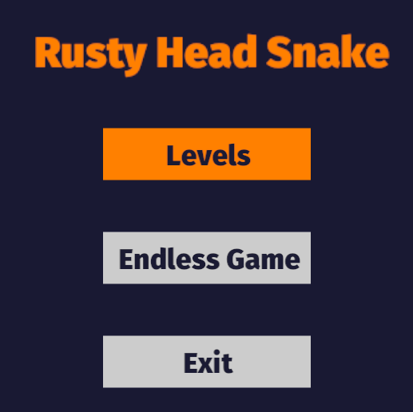
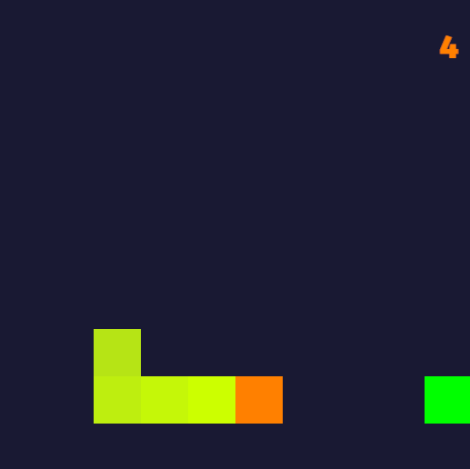
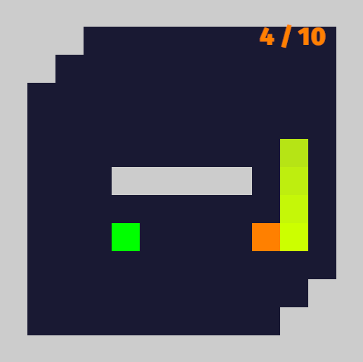
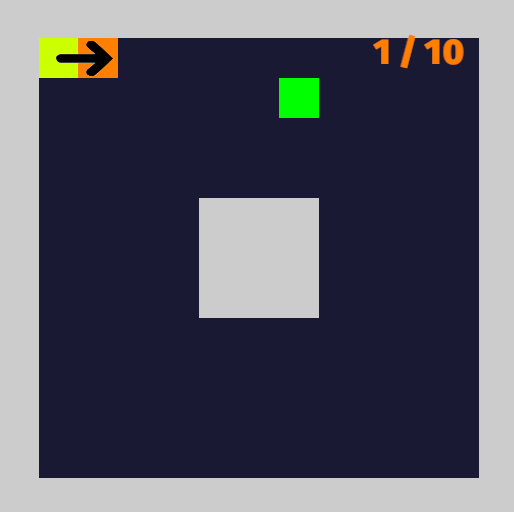

# rusty-head-snake
A simple Snake implementation in Rust.

## About the game
Just like the original game, the snake, controlled by the player has to hit targets to gain points and grow. When the snake hits parts of itself or an obstacle, the game is over. Two game modes are available:
- **Endless Game**
- **Levels**

The **Endless Game** takes place on an empty map (no obstacles) and has no point limit. The **Levels** mode allows the player to complete challenges. Levels define obstacles and the number of points the player has to reach to move on to the next level.


<div style="display: flex; justify-content: center; gap: 20px;">
  <div style="text-align: center;">
    
    <p><em>Menu</em></p>
  </div>
  <div style="text-align: center;">
    
    <p><em>Endless Game</em></p>
  </div>
  <div style="text-align: center;">
    
    <p><em>Example Level</em></p>
  </div>
</div>


## How to run

You can either clone the repository and run it locally using `cargo run` or play it in your [browser](https://tzuzuzj.github.io/rusty-head-snake/). You can also compile it to WebAssembly yourself and host it locally. Information about how to compile Rust projects to WebAssembly can be found [here](https://mq.agical.se/release-web.html).

## Adding custom levels

Custom levels can be added by putting Json-files into the **levels** directory. These files follow a strict format:
- **target_points**: Number of points the player has to reach to complete the level
- **updates_per_second**: Number of updates (graphics and game logic) per second. Accordingly, this value defines the movement speed of the snake
- **"o"**: Obstacles. When the snake hits one, the game is over
- **"s"**: Starting position of the snake
- **"d"**: Initial direction of the snake
- **"-"**: Empty field. This is were the snake is allowed to move and where targets can spawn

```Json
{
  // example_level.json
  "target_points": 10,
  "updates_per_second": 8,
  "map": [
    ["o","o","o","o","o","o","o","o","o","o","o","o","o"],
    ["o","s","d","-","-","-","-","-","-","-","-","-","o"],
    ["o","-","-","-","-","-","-","-","-","-","-","-","o"],
    ["o","-","-","-","-","-","-","-","-","-","-","-","o"],
    ["o","-","-","-","-","-","-","-","-","-","-","-","o"],
    ["o","-","-","-","-","o","o","o","-","-","-","-","o"],
    ["o","-","-","-","-","o","o","o","-","-","-","-","o"],
    ["o","-","-","-","-","o","o","o","-","-","-","-","o"],
    ["o","-","-","-","-","-","-","-","-","-","-","-","o"],
    ["o","-","-","-","-","-","-","-","-","-","-","-","o"],
    ["o","-","-","-","-","-","-","-","-","-","-","-","o"],
    ["o","-","-","-","-","-","-","-","-","-","-","-","o"],
    ["o","o","o","o","o","o","o","o","o","o","o","o","o"]
  ]
}
```

The rendered example level looks as following:
- The green object represents a randomly placed target
- The arrow shows the initial direction of the snake

<p>
    
</p>
<p>
    <em>Rendered example level</em>
</p>

<br>The sequence of the levels depends on the alphabetical order of the file names. For example, level_1 is loaded before level_2. After all custom levels are completed, the base levels are loaded.


## Contributing

Contributions for additional levels, game modes, bug fixes, and so on are always welcomed.
